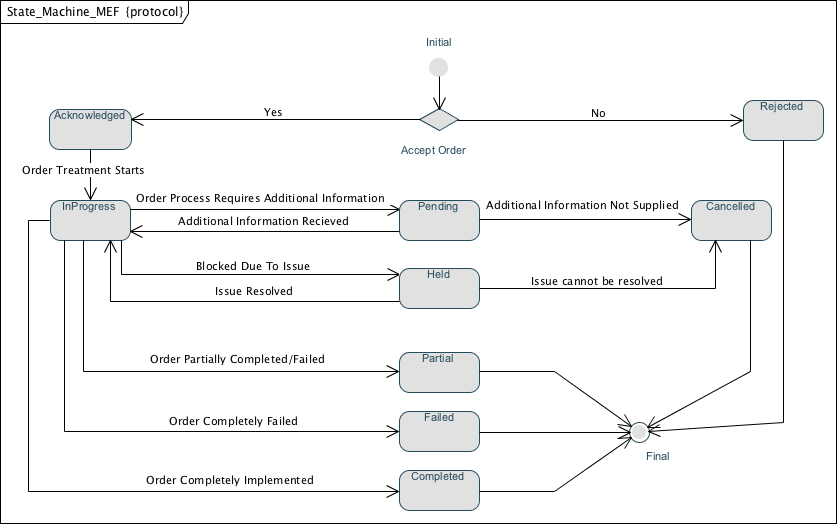

# Order

This Order repository contains an Order API that meets the business requirements documented by the Joint OBF OS/MEF LSO Sonata Ordering Team.
This API conforms to the business requirements stated in the Carrier Ethernet Ordering Technical Specification located in [LSO Sonata - Ethernet Ordering (Joint MEF-ATIS OBF)](https://github.com/indexzero/http-server), inclusive of CfC comments resolved as of 2/27/2016.
The CfC comments are also located in [LSO Sonata - Ethernet Ordering (Joint MEF-ATIS OBF)](https://github.com/indexzero/http-server) in a spreadsheet called CfCBComments-Ordering-consolidated.

The Order state machine that is being used by the Joint OBF OS/MEF LSO Sonata Ordering Project is provided below. This state machine is based upon TMForum Order State machine, and will need to be revised (either by TMForum, or the Joint OBF OS/MEF LSO Sonata Ordering Team to fully meet the needs defined in then Carrier Ethernet Ordering Technical Specification.

##API

The Order API is described in [Order API](order-api.md)

The Order Status and Notification API is described in [Order Status and Notification API](order-status-and-notifications-api.md)